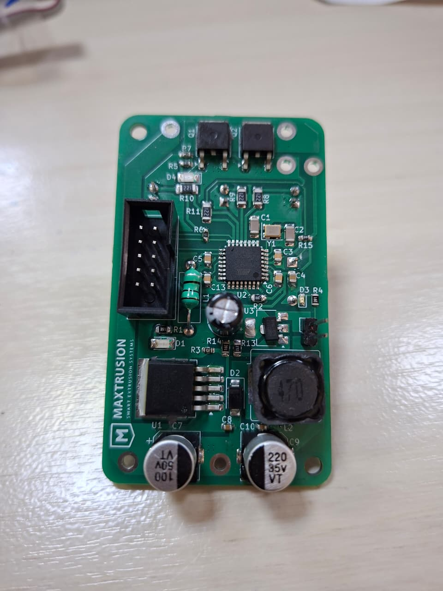
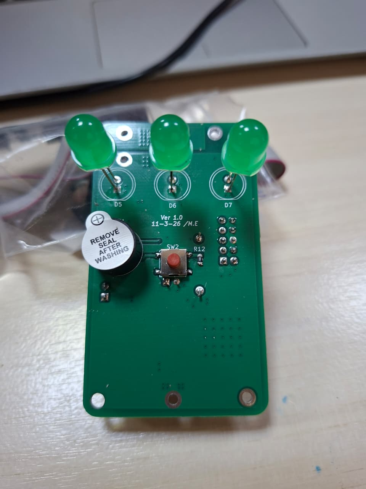
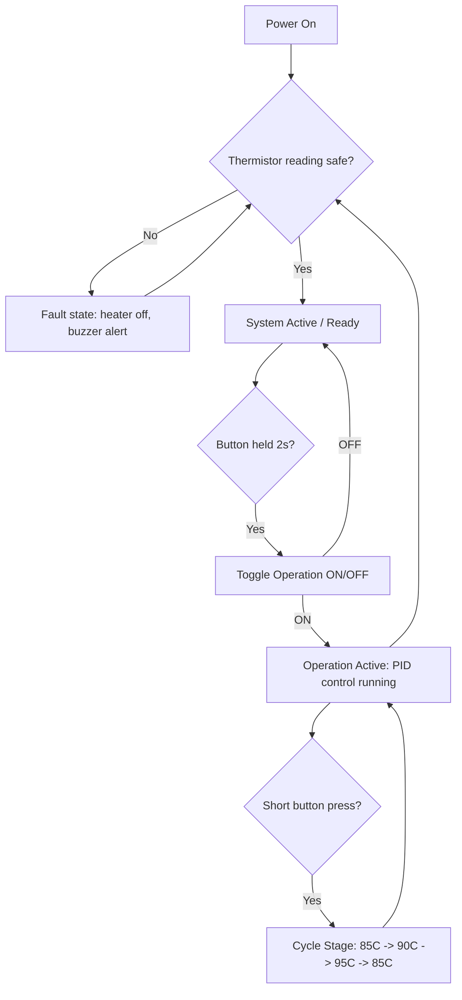

# Closed-Loop PID Polyimide Heater Controller

A compact 72×42 mm PCB that drives a polyimide (Kapton) film heater with closed-loop PID temperature control, selectable between three preset temperature stages via a single push button.




## Overview

This project was built to precisely and safely regulate the surface temperature of a polyimide heating element. Power switching is handled by a parallel dual-MOSFET stage driven by PWM from an ATmega328P, with temperature feedback provided by an NTC thermistor mounted on the heater. An onboard PID loop continuously adjusts duty cycle to track one of three user-selectable setpoints, with fault detection to shut everything down if the thermistor reading looks unsafe or the sensor is disconnected.

## Key Features

- **Closed-loop PID control** — thermistor feedback drives a PID loop that adjusts PWM duty cycle to hold the heater at the selected setpoint.
- **3 selectable temperature stages** (85 °C / 90 °C / 95 °C) — cycled with short button presses, each with its own status LED.
- **Press-and-hold start/stop** — holding the button for 2 seconds toggles the heater operation on or off, preventing accidental activation.
- **Fault protection** — the system continuously checks that the thermistor reading is within a safe, plausible range. If the reading looks unsafe (over-temperature or a disconnected/shorted sensor), the heater is disabled, a buzzer alert sounds, and the system latches into a fault state until conditions are safe again.
- **High-frequency PWM (~20 kHz)** — generated via direct Timer2 register configuration on the ATmega328P, above the audible range, for smoother MOSFET switching.
- **Averaged ADC sampling** — a rolling 500 ms window (100 samples at 5 ms spacing) smooths thermistor readings and rejects noise.
- **Audible feedback** — buzzer chirps on system start-up/ready and on operation stop.
- **Compact form factor** — entire control board fits on a 70×40 mm PCB.

## Hardware Summary

| Parameter | Value |
|---|---|
| Input power | 24 V, 5 A DC supply |
| Logic supply | Buck-regulated from 24 V rail down to 5 V for the ATmega328P |
| Power switching | 2× N-channel MOSFETs in parallel, PWM-gated |
| Microcontroller | ATmega328P (Arduino-compatible) |
| Temperature sensing | NTC thermistor (100 kΩ @ 25 °C, β ≈ 3950), voltage-divider with 100 kΩ series resistor |
| PWM frequency | ~20 kHz (Timer2, Fast PWM mode, prescaler 8, TOP = 99) |
| User interface | 1× push button, 3× status LEDs, 1× buzzer |
| Board size | 72 × 42 mm |

See [`hardware/README.md`](hardware/README.md) for schematic, PCB layout, and BOM details.

## How It Works

### Temperature sensing & safety check

The thermistor voltage is sampled every 5 ms and averaged over a rolling 500 ms window, then converted to °C using the Beta-parameter (simplified Steinhart-Hart) equation. Every loop iteration checks that:

- the computed temperature is below a danger threshold, **and**
- the raw ADC reading is below a value that would indicate a disconnected or shorted sensor.

If both checks pass, the system is marked safe and ready. If either fails, the system immediately disables the heater output, sounds the buzzer, and stays latched in a fault state until the reading recovers.

### Stage selection & control

Below is the operational flow, from power-up through fault handling:



Once operation is active, a PID loop (`Kp = 5.35, Ki = 0.5, Kd = 0.26`) computes a PWM duty cycle (0–80%) from the error between the current and target temperature, with integral anti-windup clamping. The corresponding status LED blinks while the heater is below its stage's threshold and turns solid once that threshold is reached.

See [`firmware/README.md`](firmware/README.md) for the full pin map and control-loop details.

## Repository Structure

```
heater-control-pcb/
├── README.md                 <- you are here
├── firmware/
│   ├── README.md             <- pin map, build/flash instructions, control logic
│   └── src/
│       └── main.cpp
├── hardware/
│   ├── README.md             <- PCB/schematic details, BOM
│   ├── schematic/            <- schematic PDF / source files
│   ├── pcb/                  <- PCB layout files, layer plots
│   ├── gerbers/              <- fabrication-ready Gerber/drill files
│   └── bom/                  <- bill of materials
└── docs/
    └── images/                <- board photos, renders, diagrams
```

## Getting Started

1. Clone the repository.
2. Fabricate the PCB using the files in [`hardware/gerbers`](hardware/gerbers).
3. Assemble per the BOM in [`hardware/bom`](hardware/bom).
4. Flash `firmware/src/main.cpp` to the ATmega328P — see [`firmware/README.md`](firmware/README.md) for details.
5. Connect a 24 V / 5 A supply and the polyimide heater + thermistor assembly.

## Gallery

| | | |
|---|---|---|
|  |  |  |


## Author

Built by Mahmoud Elyamani. Feel free to reach out with questions or suggestions.
