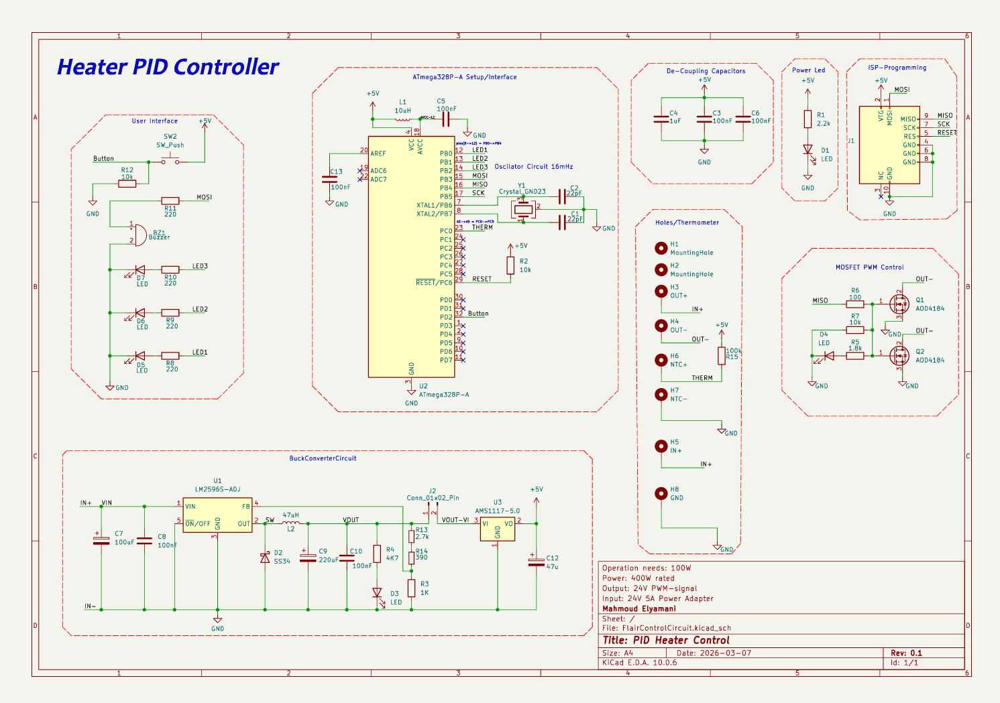
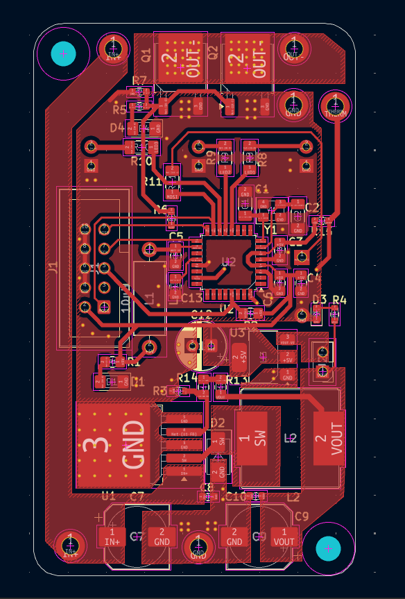
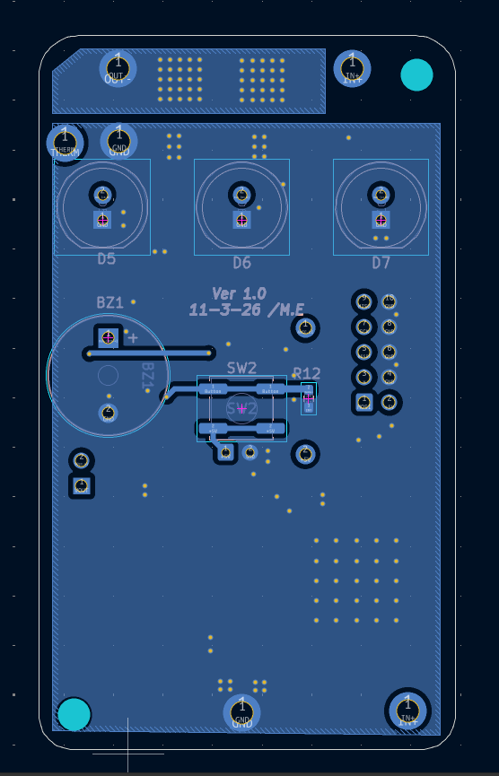
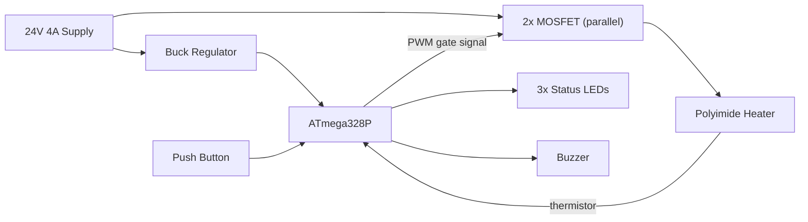

# Hardware

Schematic, PCB layout, and fabrication files for the heater controller board.

 

## Board Specs

| Parameter | Value |
|---|---|
| Dimensions | 70 × 40 mm |
| Input | 24 V DC, 4 A |
| Logic rail | 5 V, generated on-board via a buck regulator from the 24 V input |
| Power stage | 2× N-channel MOSFETs in parallel, PWM-driven from the MCU |
| MCU | ATmega328P |
| Sensing | NTC thermistor input (100 kΩ @ 25 °C, β ≈ 3950) via voltage divider |
| Outputs | Heater PWM (MOSFET gate), 3× LED, 1× buzzer |
| Input protection | *(document fuse/reverse-polarity/TVS protection here, if present)* |

## Power Architecture

The 24 V rail feeds the MOSFET power stage directly and is stepped down separately for the microcontroller's 5 V logic supply, so heater switching noise is isolated from the control electronics as much as the layout allows.

## Why two parallel MOSFETs?

Splitting the switched current across two MOSFETs in parallel reduces the conduction losses (I²R) and thermal load per device compared to a single MOSFET rated for the full heater current, which helps keep both devices cooler on a compact 70×40 mm board with limited copper area for heatsinking.

## Directory Contents

- **`schematic/`** — schematic source file(s) and exported PDF.
- **`pcb/`** — PCB layout source file(s), layer plots / renders.
- **`gerbers/`** — fabrication-ready Gerber + drill files (zip per revision, e.g. `heater-controller-rev1-gerbers.zip`).
- **`bom/`** — bill of materials (CSV/XLSX), ideally with mouser/digikey/lcsc part numbers.

## Revision History

| Rev | Date | Notes |
|---|---|---|
| 1.0 | *(date)* | Initial release |
